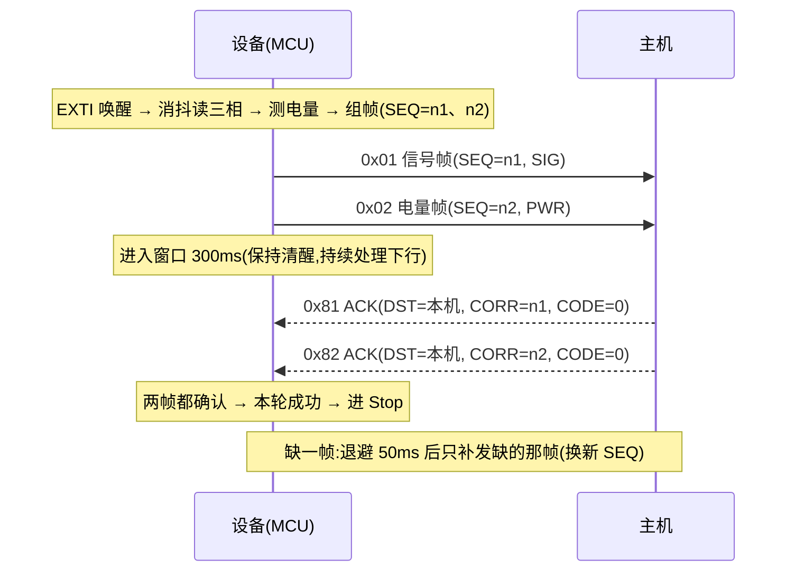

# LoRa 通信协议 v1.5（设备 ↔ 主机，带 ACK 交付确认）

| 项 | 值 |
|---|---|
| 版本 | v1.5 |
| 日期 | 2026-10-08 |
| 适用固件 | `App/app_lora_procotol.c` / `App/app_lora_procotol.h`（设备侧）；主机侧按本文档实现 |
| 空口模块 | 亿佰特 E32 系列，当前为透明/广播模式（定点传输见 §10） |
| 前身 | v1（`5A ADDR LEN FUN DATA CRC`，无 SEQ、无 ACK） |
| 后续 | v2 组网协议（`Docs/LoRa_Protocol_v2.md`，SRC/GRP + 定点传输，未来方向） |

---

## 1. 概述

- 设备在有事件（三相触点跳变）时主动上报，**一轮 = 信号帧（0x01）+ 电量帧（0x02）两帧连发**；
- 主机对收到的每一帧立即回 **ACK**；
- 设备在一个窗口内收齐两个 ACK 才算交付成功；**缺哪帧只补发哪帧**（换新 SEQ，最多重发 2 次）；
- 交付完成（成功或重试用尽）之前，设备不进 Stop 低功耗；
- 超时/失败只记录统计，不阻塞下一次上报。



---

## 2. 地址约定

| 帧方向 | 地址字节 `[1]` 的含义 | 说明 |
|---|---|---|
| 设备 → 主机（上行） | **本机（源）地址**（`APP_DEVICE_ADDR`） | 主机靠它区分是哪台设备 |
| 主机 → 设备（下行） | **目标设备地址** | 设备只处理 `[1]==本机地址` 或 `[1]==0xFF` 的帧 |

- 每台设备地址必须唯一（如 0x01/0x02/0x03）；**`0xFF` 保留为广播地址，不可用作设备地址**；
- 主机模块自身地址设为 `0xFFFF`（广播）不影响过滤——设备看的是**帧里填的地址**；
- **ACK 必须精确指向目标设备**（`[1]==设备地址`）：固件忽略广播 ACK，避免多台设备 SEQ 相同时互相误确认；
- 点名命令允许广播（`[1]=0xFF`，同信道所有设备都会响应，注意空口碰撞）。

---

## 3. 帧结构（公共）

```
[0] HEAD = 0x5A
[1] ADDR        （见 §2 地址约定）
[2] LEN         = 整帧字节数（含帧头与 CRC）
[3] FUN         （功能码）
[4 .. LEN-2]    数据域（长度随帧型变化）
[LEN-1]         CRC8
```

- **CRC8**：多项式 `0x07`，初值 `0x00`，覆盖 `[0 .. LEN-2]`；
- 收帧流程：找 `0x5A` → 按 `LEN` 收满 → CRC 校验通过才处理；
- 字节间超时 `LORA_FRAME_GAP_MS`（默认 50ms）：半帧自动丢弃、重找帧头；
- `LEN` 必须在 `[5, 17]` 范围内（`LORA_FRAME_MIN_LEN ~ LORA_FRAME_BUF_MAX`），否则丢帧。

---

## 4. 上行帧（设备 → 主机）

### 4.1 信号帧 `FUN=0x01`（7 字节）

| 偏移 | 0 | 1 | 2 | 3 | 4 | 5 | 6 |
|---|---|---|---|---|---|---|---|
| 字段 | HEAD | SRC 本机地址 | LEN=0x07 | FUN=0x01 | SEQ | SIG | CRC8 |

- `SIG`：`0xAA` = 挂接完成（三相均为低电平）；`0x55` = 未完成；
- `SEQ`：发送序号，每发一帧 +1（0~255 回绕）；**重发也换新 SEQ**。

### 4.2 电量帧 `FUN=0x02`（7 字节）

| 偏移 | 0 | 1 | 2 | 3 | 4 | 5 | 6 |
|---|---|---|---|---|---|---|---|
| 字段 | HEAD | SRC 本机地址 | LEN=0x07 | FUN=0x02 | SEQ | PWR | CRC8 |

- `PWR`：0~100 = 电量百分比；**`0xFF` = 读取失败/无效**（主机按无效处理）。

### 4.3 完整示例（含 CRC，可直接对照）

| 场景 | 字节流 |
|---|---|
| 设备 0x01 上报信号（SEQ=0x2A，挂接完成） | `5A 01 07 01 2A AA ED` |
| 设备 0x01 上报电量（SEQ=0x2B，87%） | `5A 01 07 02 2B 57 B8` |

---

## 5. 下行帧（主机 → 设备）

### 5.1 ACK 帧 `FUN = 上行FUN | 0x80`（7 字节）

| 偏移 | 0 | 1 | 2 | 3 | 4 | 5 | 6 |
|---|---|---|---|---|---|---|---|
| 字段 | HEAD | DST 目标设备地址 | LEN=0x07 | FUN=0x81(对信号) / 0x82(对电量) | CORR=被确认帧的 SEQ | CODE | CRC8 |

- `CODE`：`0x00` = 主机已正确接收；非 0 表示拒收（设备不再重发，直接记失败）；
- **匹配规则**（设备侧）：处于等待窗口 且 `[1]==本机地址` 且 `FUN&0x7F` 与在等的帧一致 且 `CORR==当前 SEQ` → 该帧确认；
- 迟到 ACK（旧 SEQ）、重复 ACK（已确认帧）、广播 ACK 一律忽略。

### 5.2 点名命令 `FUN=0x10 / 0x11`（5 字节，当前无数据域）

| 偏移 | 0 | 1 | 2 | 3 | 4 |
|---|---|---|---|---|---|
| 字段 | HEAD | DST 目标设备地址（可 0xFF 广播） | LEN=0x05 | FUN=0x10 取电量 / 0x11 取信号 | CRC8 |

- 设备收到后**立即**回一帧对应上行帧（0x02 / 0x01，带新 SEQ），**不等 ACK**；
- 命令码迁移说明：旧版（v1）用 `0x81/0x82` 作点名命令，现已让给 ACK 码，命令迁到 `0x10/0x11`。

### 5.3 完整示例（含 CRC）

| 场景 | 字节流 |
|---|---|
| 主机回信号 ACK（设备 0x01，确认 SEQ=0x2A） | `5A 01 07 81 2A 00 B9` |
| 主机回电量 ACK（确认 SEQ=0x2B） | `5A 01 07 82 2B 00 11` |
| 主机拒收信号帧（CODE=0x02） | `5A 01 07 81 2A 02 B7` |
| 主机点名取信号（设备 0x01） | `5A 01 05 11 3D` |
| 主机点名取电量（设备 0x01） | `5A 01 05 10 3A` |
| 广播点名取电量（所有设备应答，慎用） | `5A FF 05 10 7A` |

---

## 6. 交付确认流程（单窗口双 ACK + 缺帧重发）

> **固件开关**:本章流程由 `app_config.h` 的 `APP_LORA_ACK_ENABLE` 编译期控制。
> 置 `0`(样机简化版)时,设备把两帧**背靠背发出即结束** —— 不等 ACK、不重发、不重发退避,
> 也不占用事务(发完立刻允许进 Stop);**空口帧格式与本章完全一致**,主机照本章回 ACK 即可,
> 设备会直接忽略 ACK。置 `1` 时恢复本章全部流程(代码始终保留,仅编译期裁剪)。
> 当前交付版本为 `0`。

### 6.1 时序与参数

| 参数（宏） | 默认 | 说明 |
|---|---|---|
| `APP_LORA_ACK_TIMEOUT_MS` | 300ms | 等 ACK 窗口，**从两帧都发完开始计** |
| `APP_LORA_RETRY_MAX` | 2 | 每帧最多重发次数（每帧总发送 ≤ 1+2 次） |
| `APP_LORA_RETRY_BACKOFF_MS` | 50ms | 补发前退避（错开碰撞） |
| `APP_LORA_TX_BACKOFF_MS` | 0 | 首帧发送前退避；多节点同信道建议 0~150 随机错峰 |
| `LORA_FRAME_GAP_MS` | 50ms | 收帧字节间超时（半帧丢弃） |

> 以上默认值按当前模块设置（空速 2.4k / 串口 9600）估算；若改用 0.3k 空速，需加大窗口至 ≥800ms。

### 6.2 重发与失败规则

| 情况 | 设备行为 |
|---|---|
| 窗口内两个 ACK 都到 | 本轮成功（`round_ok++`） |
| 只到一个 ACK | 退避 50ms 后**只补发缺 ACK 的那一帧**（换新 SEQ），重新开窗 |
| 重发额度用尽 | 该帧记失败（`sig_fail` / `pwr_fail`），不重发、不影响另一帧 |
| 收到 `CODE≠0` 的 ACK | 该帧按失败处理（重发无意义），记录 |
| 事务进行中又发生新事件 | 新快照暂存（覆盖式），本轮结束后**自动再发一轮**，不会堆积多轮 |

- 失败不阻塞后续事件；设备完成本轮（成功或失败）后即允许进 Stop；
- 主机侧不需要去重：重发用新 SEQ，语义是"至少一次"，同一数据以最后一条为准；
- 统计接口：`app_lora_uplink_get_stats()` 返回 `round_ok / sig_fail / pwr_fail / retry_cnt`。

### 6.3 时间预算（参考）

| 场景 | 耗时（量级） |
|---|---|
| 典型单轮（一次成功，含消抖/测电量） | ≈ 0.1~0.2s 清醒 |
| 最坏单轮（每帧 2 次重发、全超时） | ≈ 1.3s 清醒（消抖 0.2s + 3×300ms + 退避） |

---

## 7. 设备侧接收处理一览

| 收到的帧 | 处理条件 | 行为 |
|---|---|---|
| ACK（0x81/0x82） | `[1]==本机地址` 且 `CORR==当前等待的 SEQ` | 确认对应帧（CODE=0 记成功，否则记失败） |
| 点名命令（0x10/0x11） | `[1]==本机地址` 或 `0xFF` | 立即应答对应上行帧（新 SEQ，不等 ACK） |
| 其它（含广播 ACK、旧 SEQ、未知 FUN） | — | 丢弃 |

---

## 8. 主机侧实现要求

1. 收到上行帧（0x01 / 0x02）→ 校验 CRC → 解析 → **≤100ms 内**回对应 ACK；
2. ACK 的 `[1]` 必须填**该设备的地址**（精确到设备，不能广播，否则设备忽略）；
3. `CORR` 原样回填收到的 `SEQ`；处理正常回 `CODE=0`，否则回非 0 错误码；
4. 用上行帧的 `[1]`（源地址）区分设备，按设备建表；
5. 若实现点名命令：用 `0x10/0x11`，`[1] = 目标设备地址`（广播用 `0xFF`，注意多设备同时应答的碰撞）；
6. 重传容错：同一数据可能以不同 SEQ 到达两次，按"最后一次为准"。

### CRC8 参考实现（与固件一致）

```c
uint8_t crc8(const uint8_t *d, int len) {
    uint8_t crc = 0x00;
    for (int i = 0; i < len; i++) {
        crc ^= d[i];
        for (int j = 0; j < 8; j++)
            crc = (crc & 0x80) ? (uint8_t)((crc << 1) ^ 0x07) : (uint8_t)(crc << 1);
    }
    return crc;
}
/* 对 [0 .. LEN-2] 计算，结果放 [LEN-1] */
```

---

## 9. 多设备与部署注意

- 同信道多台设备依赖**帧内地址**做软件过滤（不匹配的帧仍会进入各设备接收 FIFO，由固件丢弃）；
- 设备地址必须唯一；`0xFF` 保留给广播；
- 短时并发（多台同时上报）靠发送前退避（可选）+ 重发退避缓解；
- 空口占用评估建议：`节点数 × 上报频率 × 帧空中时间 < 信道容量 10%`（详见 v2 文档 §8）。

---

## 10. 与 v2 的关系 / 演进方向

- 本协议是 v2 组网落地前的过渡版本：沿用 v1 的短帧（7 字节）与功能码语义，补充 SEQ/ACK/重发；
- v2 将引入 `VER / SRC(2B) / GRP / CORR` 完整字段与**定点传输**（`REG2[7]=1`，发送前加 3 字节目标地址），实现硬件级地址过滤与组网；
- 迁移时功能码语义不变（0x01 信号、0x02 电量），主机侧显示逻辑可保留，仅帧层与寻址方式替换。

---

## 11. 变更记录

| 版本 | 日期 | 说明 |
|---|---|---|
| v1.5 | 2026-10-08 | 上行帧加 `SEQ`；新增 ACK（`FUN\|0x80` + `CORR` + `CODE`）；单窗口双 ACK + 缺帧重发；下行地址字节改为"目标设备地址"语义；点名命令迁移 `0x81/0x82 → 0x10/0x11` |
| v1 | 2026-09-16 | `5A ADDR LEN FUN DATA CRC`，无 SEQ、无确认 |
