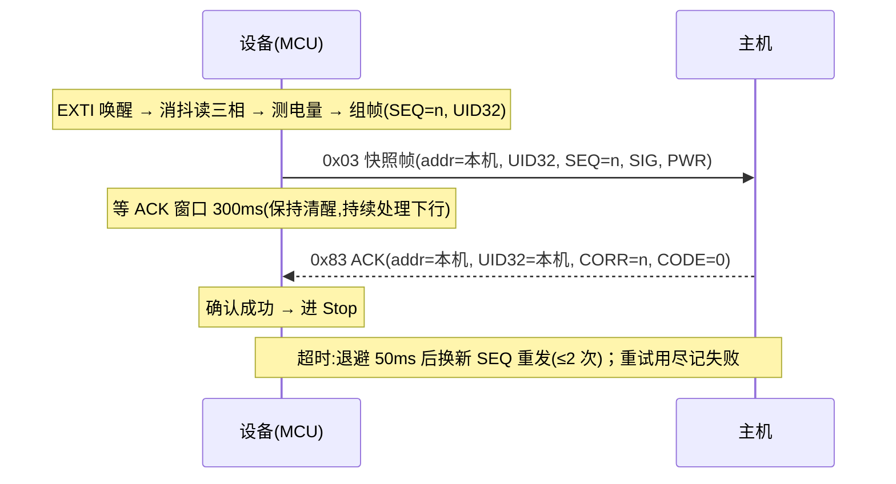

# LoRa 通信协议 v1.6（设备 ↔ 主机，合并快照帧 + UID32 标识 + ACK）

| 项 | 值 |
|---|---|
| 版本 | v1.6 |
| 日期 | 2026-10-09 |
| 适用固件 | `App/app_lora_procotol.c` / `App/app_lora_procotol.h`（设备侧）；主机侧按本文档实现 |
| 空口模块 | 亿佰特 E32 系列，透明/广播模式（定点传输见 §10） |
| 前身 | v1.5（信号/电量各一帧、双 ACK）；v1（无 SEQ、无确认） |
| 后续 | v2 组网协议（`Docs/LoRa_Protocol_v2.md`，SRC/GRP + 定点传输） |

---

## 1. 概述

- 设备有事件（三相触点跳变）时上报 **一帧状态快照（FUN=0x03）**：信号 + 电量 + 设备 UID32 + SEQ；
- 主机校验身份后立即回 **ACK（FUN=0x83）**；
- 设备在窗口内收到确认（CORR 匹配）即完成本轮；超时**换新 SEQ 重发**（最多 2 次）；
- 重试用尽/被拒只记统计，不阻塞下一次上报；本轮完成前设备不进 Stop 低功耗；
- **每帧携带设备 UID32**：主机据此建立"本套设备白名单"，同信道其他套设备的帧直接过滤，防止误收误解析。



---

## 2. 身份识别与寻址

帧里同时携带**设备地址**与**设备 UID32**（两个方向）：

| 帧方向 | `[1]` 地址 | `[4..7]` UID32 | 含义 |
|---|---|---|---|
| 设备 → 主机（上行） | 本机（源）地址 | **本机 UID32** | 主机靠这两者确认"这是本套的哪台设备" |
| 主机 → 设备（下行） | 目标设备地址 | **目标设备 UID32** | 设备靠这两者确认"这条 ACK/命令是给我的" |

**UID32 的定义**（96bit 唯一 ID 经 FNV-1a 派生的 32bit 短标识）：

```text
h = 2166136261
按顺序取 UID w0、w1、w2（HAL_GetUIDw0/1/2），每个字按低字节→高字节：
    h ^= byte
    h *= 16777619   (mod 2^32)
uid32 = h
```

- 设备侧实现：`app_lora_uid32()`（首次调用读取并缓存），开机日志会打印 `Device UID32: 0xXXXXXXXX`；
- 主机侧**不需要重新计算**，只需记录并逐帧比对；
- 96bit 全量 UID 不空口传输（帧会过长）；工厂台账可用设备开机打印的 UID32/串口输出登记；
- 冲突概率：百台设备同组内约 $10^{-6}$ 量级，可忽略；若日后发现有重复（或批量生产需要更严格登记），可在 v2 迁移时升级为 64bit 短码或"登记帧交换全量 UID"。

**广播规则**（当前仅定义给命令）：

| 帧型 | 地址 | UID32 | 说明 |
|---|---|---|---|
| 定向帧 | 具体设备地址 | 该设备 UID32 | 定向 ACK 与定向命令 |
| 广播帧 | `0xFF` | `0x00000000` | 仅命令可广播，所有设备都会应答（注意碰撞） |
| 广播 ACK | — | — | **不允许**，设备一律忽略 |

- 设备地址必须唯一；`0xFF` 保留为广播地址；
- 主机模块自身地址设为 `0xFFFF`（广播）不影响以上规则 —— 设备过滤看的是**帧里填的地址与 UID32**。

---

## 3. 帧结构（公共）

```
[0] HEAD = 0x5A
[1] ADDR        （见 §2）
[2] LEN         = 整帧字节数（含帧头与 CRC）
[3] FUN         （功能码）
[4 .. LEN-2]    数据域（含 UID32，长度随帧型变化）
[LEN-1]         CRC8
```

- **CRC8**：多项式 `0x07`，初值 `0x00`，覆盖 `[0 .. LEN-2]`；
- 收帧流程：找 `0x5A` → 按 `LEN` 收满 → CRC 通过才处理；
- 字节间超时 `LORA_FRAME_GAP_MS`（默认 50ms）丢弃半帧；
- `LEN` 范围 `[9, 24]`（`LORA_FRAME_MIN_LEN ~ LORA_FRAME_BUF_MAX`），超范围丢帧。

---

## 4. 上行帧（设备 → 主机）

### 4.1 状态快照帧 `FUN=0x03`（12 字节）

| 偏移 | 0 | 1 | 2 | 3 | 4..7 | 8 | 9 | 10 | 11 |
|---|---|---|---|---|---|---|---|---|---|
| 字段 | HEAD | SRC 本机地址 | LEN=0x0C | FUN=0x03 | UID32（小端） | SEQ | SIG | PWR | CRC8 |

- `UID32`：低字节在前（`[4]`=bit0..7，`[7]`=bit24..31）；
- `SEQ`：发送序号，每发一帧 +1（0~255 回绕）；**重发也换新 SEQ**；
- `SIG`：`0xAA` = 挂接完成（三相均低）；`0x55` = 未完成；
- `PWR`：0~100 电量百分比；**`0xFF` = 读取失败/无效**。

### 4.2 完整示例（含 CRC，可直接对照）

示例 UID32 取 `0xA1B2C3D4`（实际以设备开机打印为准）：

| 场景 | 字节流 |
|---|---|
| 设备 0x01 上报（SEQ=0x2A，挂接完成，87%） | `5A 01 0C 03 D4 C3 B2 A1 2A AA 57 03` |
| 设备 0x01 上报（SEQ=0x2B，未挂接，电量无效） | `5A 01 0C 03 D4 C3 B2 A1 2B 55 FF EE` |

---

## 5. 下行帧（主机 → 设备）

### 5.1 ACK 帧 `FUN=0x83`（11 字节）

| 偏移 | 0 | 1 | 2 | 3 | 4..7 | 8 | 9 | 10 |
|---|---|---|---|---|---|---|---|---|
| 字段 | HEAD | DST 目标设备地址 | LEN=0x0B | FUN=0x83 | 目标设备 UID32 | CORR=被确认帧的 SEQ | CODE | CRC8 |

- `CODE`：`0x00` = 已正确接收；非 0 = 拒收（设备不再重发，记拒绝统计）；
- **匹配规则**（设备侧）：处于等待窗口 且 `addr==本机` 且 `UID32==本机` 且 `FUN==0x83` 且 `CORR==在途 SEQ` → 该帧确认；
- 迟到 ACK（旧 SEQ）、重复 ACK、广播 ACK 一律忽略。

### 5.2 点名命令 `FUN=0x10 / 0x11`（9 字节）

| 偏移 | 0 | 1 | 2 | 3 | 4..7 | 8 |
|---|---|---|---|---|---|---|
| 字段 | HEAD | DST 目标设备地址（广播=0xFF） | LEN=0x09 | FUN=0x10 取电量 / 0x11 取信号 | 目标设备 UID32（广播=0） | CRC8 |

- 设备收到后**立即回一帧 0x03 快照帧**（带新 SEQ），**不等 ACK**（主机按请求自行关联）；
- 应答内容取"最近一次已知快照"（未上报过时字段为 0）。

### 5.3 完整示例（含 CRC）

| 场景 | 字节流 |
|---|---|
| 主机回 ACK（设备 0x01，确认 SEQ=0x2A） | `5A 01 0B 83 D4 C3 B2 A1 2A 00 97` |
| 主机回 ACK（确认 SEQ=0x2B） | `5A 01 0B 83 D4 C3 B2 A1 2B 00 82` |
| 主机拒收快照帧（CODE=0x02） | `5A 01 0B 83 D4 C3 B2 A1 2A 02 99` |
| 主机点名取电量（设备 0x01） | `5A 01 09 10 D4 C3 B2 A1 70` |
| 主机点名取信号（设备 0x01） | `5A 01 09 11 D4 C3 B2 A1 12` |
| 广播点名取电量（所有设备应答，慎用） | `5A FF 09 10 00 00 00 00 45` |

---

## 6. 交付确认流程（单帧窗口 + 超时重发）

### 6.1 参数

| 参数（宏） | 默认 | 说明 |
|---|---|---|
| `APP_LORA_ACK_ENABLE` | 0（样机）/ 1（正式） | 0=发出即结束（不等 ACK）；1=完整交付流程 |
| `APP_LORA_ACK_TIMEOUT_MS` | 300ms | 等 ACK 窗口（从帧发出后开始计） |
| `APP_LORA_RETRY_MAX` | 2 | 最多重发次数（总发送 ≤ 1+2 次） |
| `APP_LORA_RETRY_BACKOFF_MS` | 50ms | 重发前退避（错开碰撞） |
| `APP_LORA_TX_BACKOFF_MS` | 0 | 首帧发送前退避；多节点同信道建议 0~150 随机错峰 |
| `LORA_FRAME_GAP_MS` | 50ms | 收帧字节间超时（半帧丢弃） |

> 以上按当前模块设置（空速 2.4k / 串口 9600）估算；若改用 0.3k 空速，需加大窗口至 ≥800ms。

### 6.2 重发与失败规则

| 情况 | 设备行为 |
|---|---|
| 窗口内收到匹配 ACK（CODE=0） | 本轮成功（`round_ok++`），允许进 Stop |
| 窗口超时且尚有额度 | 退避 50ms 后**换新 SEQ 重发** |
| 重发额度用尽 | 记失败（`round_fail++`），允许进 Stop |
| 收到 `CODE≠0` 的 ACK | 记拒绝（`rejected++`），不再重发 |
| 事务进行中又发生新事件 | 新快照暂存（覆盖式），本轮结束后**自动再发一轮** |

- 主机侧无需去重：重发用新 SEQ，语义"至少一次"，同一数据以最后一条为准；
- 统计接口：`app_lora_uplink_get_stats()` 返回 `round_ok / round_fail / rejected / retry_cnt`。

### 6.3 时间预算（参考）

| 场景 | 耗时（量级） |
|---|---|
| 典型单轮（一次成功，含消抖/测电量） | ≈ 0.1~0.2s 清醒 |
| 最坏单轮（2 次重发全超时） | ≈ 1.2s 清醒（消抖 0.2s + 3×300ms + 退避） |

---

## 7. 设备侧接收处理一览

| 收到的帧 | 处理条件 | 行为 |
|---|---|---|
| ACK（0x83） | `addr==本机` 且 `UID32==本机` 且 `CORR==在途 SEQ` | 确认（CODE=0）或记拒绝 |
| 点名命令（0x10/0x11） | `addr==本机` 且 `UID32==本机`；或广播（0xFF 且 UID32=0） | 立即回 0x03 快照帧 |
| 其他（含广播 ACK、身份不匹配、旧 SEQ、未知 FUN） | — | 丢弃 |

---

## 8. 主机侧实现要求

1. **白名单**：为每台设备记录 `(addr, uid32)`（uid32 从设备上行帧/开机日志获得）；收到上行先比对 `[1]` 与 `[4..7]`，不匹配直接丢弃 —— 这一步就是"防止其他主机误收解析"的关键；
2. 收到 0x03 快照帧 → 校验 CRC → **≤100ms 内**回 0x83 ACK：`CORR` 原样回填收到的 `SEQ`，`DST` 与 `UID32` 都填**该设备**的（不能广播，否则设备忽略）；
3. 点名命令用 `0x10/0x11`：定向填目标设备 `addr + UID32`；广播填 `0xFF + 0x00000000`（注意多设备同时应答的碰撞）；
4. 重传容错：同一数据可能以不同 SEQ 到达两次，按"最后一次为准"。

### CRC8 参考实现（与固件一致）

```c
uint8_t crc8(const uint8_t *d, int len) {
    uint8_t crc = 0x00;
    for (int i = 0; i < len; i++) {
        crc ^= d[i];
        for (int j = 0; j < 8; j++)
            crc = (crc & 0x80) ? (uint8_t)((crc << 1) ^ 0x07) : (uint8_t)(crc << 1);
    }
    return crc;
}
/* 对 [0 .. LEN-2] 计算，结果放 [LEN-1] */
```

---

## 9. 多设备与部署注意

- 身份过滤是**帧内软件过滤**（不匹配的帧仍会进入接收 FIFO，由固件/主机丢弃）；
- 设备地址必须唯一；`0xFF` 保留给广播；UID32 全局唯一（自动，无需产线配置）；
- 短时并发（多台同时上报）靠发送前退避（可选）+ 重发退避缓解；
- 空口占用评估建议：`节点数 × 上报频率 × 帧空中时间 < 信道容量 10%`（详见 v2 文档 §8）。

---

## 10. 与 v2 的关系 / 演进方向

- 本协议是 v2 组网落地前的过渡版本：短帧（12 字节）+ 帧内身份过滤；
- v2 将引入 `VER / SRC(2B) / GRP / CORR` 完整字段与**定点传输**（`REG2[7]=1`，发送前加 3 字节目标地址），实现硬件级地址过滤；
- UID32 概念与 v2 文档的 `app_lora_net_uid32()` 一致，迁移时字段与函数可直接沿用。

---

## 11. 变更记录

| 版本 | 日期 | 说明 |
|---|---|---|
| v1.6 | 2026-10-09 | 信号+电量合并为单帧快照（0x03）；每帧增加 **UID32 设备标识**（FNV-1a 派生），双向身份过滤；单窗口单 ACK；点名命令 0x10/0x11 应答 0x03 快照帧 |
| v1.5 | 2026-10-08 | 上行加 `SEQ`；ACK（`FUN\|0x80` + `CORR` + `CODE`）；双帧连发 + 单窗口双 ACK + 缺帧重发；下行地址改为"目标设备地址"；命令迁 `0x81/0x82 → 0x10/0x11` |
| v1 | 2026-09-16 | `5A ADDR LEN FUN DATA CRC`，无 SEQ、无确认 |
