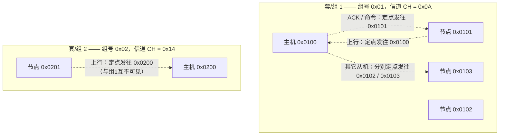
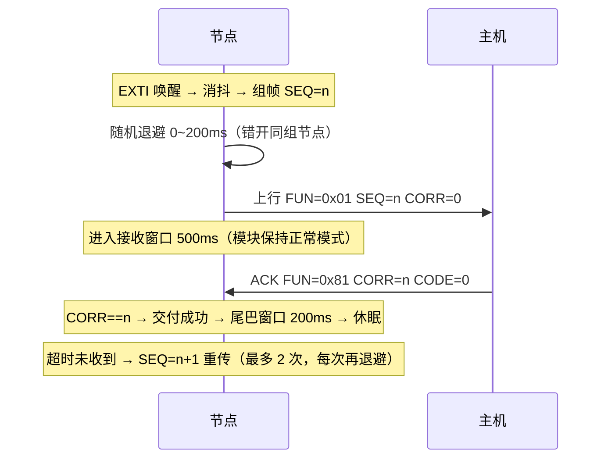
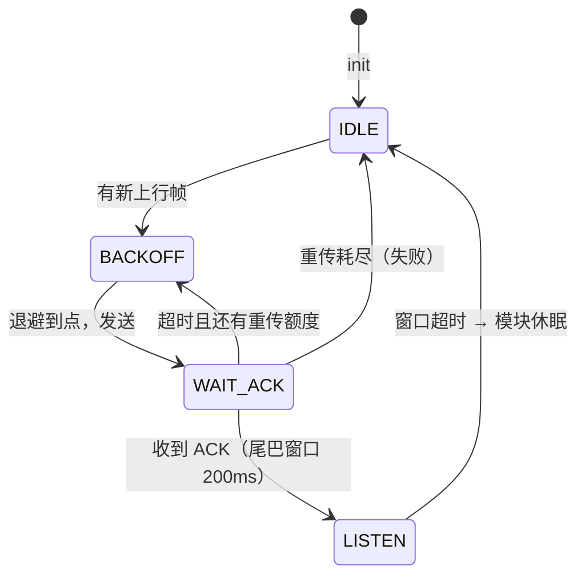

# LoRa 组网协议规范 v2（多对多：唯一识别码 + 防串频 + 交付确认）

| 项 | 值 |
|---|---|
| 版本 | v2.0 |
| 日期 | 2026-09-30 |
| 适用固件 | `App/app_lora_net.c` / `app_lora_net.h`（v0.2） |
| 空口模块 | 亿佰特 E32 系列（SX1278），定点传输模式 |
| 旧版本 | v1（`app_lora_procotol.c`，无源地址、无 ACK），**两者不互通** |

---

## 1. 目标与问题

| 问题 | 本规范的解法 |
|---|---|
| 多台设备在同一空域，如何区分"谁是谁" | 唯一识别码 = 模块地址（`ADDH/ADDL`）+ 帧内源地址 `SRC` |
| 多组设备互相干扰（串频） | 三层过滤：信道（硬件）→ 模块地址（硬件）→ 组号（软件） |
| 主机要确认"确实收到了" | 上行帧等 `ACK`，关联字段 `CORR` 匹配，超时随机退避重传 |
| 设备低功耗休眠，怎么收下行 | 上行后开接收窗口；需要"随时可唤醒"时见 §10.3 |

---

## 2. 系统拓扑

> 地址约定：`16bit = [组号 8bit][节点序号 8bit]`，主机固定为 `组号<<8`。
> 这样即使多套设备同信道，也只有「本组主机」能收到本组节点，反之亦然。



- **一套设备 = 1 主机 + 3 从机 = 1 个组号**；组号体现在地址高字节。
- **主机**：地址 = `组号<<8`（如 `0x0100`）。**千万不要所有套都用 `0x0000`** —— 那会让 A 套从机的上报被 A/B/C 所有主机收到。
- **节点**：地址 = `组号<<8 | 序号`，序号 `0x01~0x03`；掉电保存在模块寄存器里，开机读回。
- **同组必须同信道**；不同组尽量分信道（见 §4.4 与 §8.1）。
- 主机若要收全组，用**分别定点发送**即可，不需要 `0xFFFF` 监听（监听模式会把同信道所有套的报文都收进来，反而增加解析负担）。

---

## 3. 三层寻址与过滤

| 层 | 机制 | 执行者 | 效果 | 代价 |
|---|---|---|---|---|
| L1 信道 | `CHAN` 不同 | E32 硬件 | 异组数据不进入模块，MCU 完全不知道 | 无 |
| L2 地址 | 定点传输 + 地址精确匹配 | E32 硬件 | 同信道下发给别人的帧不会吐给 MCU | 无 |
| L3 组号 | 帧内 `GRP` 字段 | MCU | 兜底过滤，支持"同信道多组"部署 | 每帧 1 字节 |

### 3.1 定点传输（必须开启）

`REG2[7] = 1` 时，**发送端**在串口数据前增加 3 字节：

```
[目标 ADDH] [目标 ADDL] [目标 CHAN] + 帧数据
```

- 目标地址 `0xFF 0xFF` = 本信道广播。
- **接收端只把净荷吐给串口，不含源地址** —— 这是帧里必须带 `SRC` 的根本原因。

---

## 4. 唯一识别码（节点号）

### 4.1 唯一真源

**模块地址寄存器**就是唯一真源。设备开机流程：

1. `app_lora_net_init()` 读取模块寄存器 `[ADDH][ADDL]` → 作为内存中的节点号 `s_node_id`；
2. 读不到（模块无响应）时退回编译期宏 `APP_LORA_NET_NODE_ID`；
3. 若地址为 `0x0000` 或 `0xFFFF`，视为未分配，使用宏兜底值。

> 好处：现场用上位机改地址后**重启即生效**，不必重烧固件；固件里也不需要额外的 EEPROM 模拟。

### 4.2 保留地址

| 地址 | 用途 |
|---|---|
| `0x0000` | 主机 |
| `0xFFFF` | 广播 / 监听（不可作为节点号） |
| `0x0001`~`0xFFFE` | 节点 |

### 4.3 分配方案（已选定）

| 方案 | 结论 |
|---|---|
| 信道分组 + 地址 = 节点号 | ❌ 不采用：E32 只有 32 个信道 → 最多 32 套；批量生产不够用 |
| **地址高字节 = 组号、低字节 = 节点序号** | ✅ **采用**：256 套 × 每套 255 节点；且地址过滤是硬件行为，不耗 MCU |

代价：**不能“只广播给某一组”**（定点广播只能 `0xFFFF` 全网）。本系统一套只有 3 个从机，主机逐个点名即可，这个代价可接受。

**不要**用芯片 96bit UID 直接截断当空口地址：16bit 生日悖论下，50 台设备撞号概率约 1.9%，100 台约 7.3%。
UID 只用于入网登记：`app_lora_net_uid32()` 返回 96bit UID 派生的 32bit 短标识，可随日志/登记帧上报，主机建 `节点号 ↔ UID` 映射表检测撞号。

### 4.4 多套设备共存与批量生产部署

这是批量生产最容易出事的地方：**每套设备的地址、信道、组号不能照抄同一份固件默认值**。

#### （1）地址分配表

| 设备 | 组号 | 节点序号 | 模块地址 | 上行目标地址 |
|---|---|---|---|---|
| 主机 | `0x01` | `0x00` | `0x0100` | — |
| 从机 1 | `0x01` | `0x01` | `0x0101` | `0x0100` |
| 从机 2 | `0x01` | `0x02` | `0x0102` | `0x0100` |
| 从机 3 | `0x01` | `0x03` | `0x0103` | `0x0100` |
| （下一套） | `0x02` | `0x01~0x03` | `0x0201~0x0203` | `0x0200` |

固件侧只用两个宏就够：

```c
#define APP_LORA_NET_GROUP_ID    0x01   /* ← 每套设备不同 */
#define APP_LORA_NET_NODE_INDEX  0x01   /* ← 从机 1/2/3 = 0x01/0x02/0x03 */
/* 地址、主机地址、帧内 GRP 均由此自动推出：
     节点地址 = 0x0101，上行目标 = 0x0100，GRP = 0x01          */
```

#### （2）为什么“组号必须进地址”而不是只靠帧内 GRP

| 做法 | 别套设备的数据会发生什么 |
|---|---|
| 仅帧内 `GRP` 过滤 | 帧会**完整收进**本机 FIFO → 占接收窗口、占用空口、占 MCU 解析，只是最后被软件丢掉 |
| **组号进地址（已采用）** | 模块硬件直接丢弃 → **一个字节都不会吐给 MCU**，零代价 |

#### （3）信道规划（与地址无关的第二道防线）

地址解决“**收错人**”，信道解决“**空口碰撞**”，两者不能互相替代。

- 同空域（一栋楼/一个小区）内的套，**尽量分到不同信道**；32 个信道用完后复用（靠距离/楼层衰减隔离）。
- 相邻套的信道尽量**间隔 2~3 个**（LoRa 带宽 125kHz，相邻信道隔离度有限）。
- 两种配置方式：
  - `APP_LORA_NET_CHANNEL` 固定值（缺省，主机侧好对齐）；
  - `APP_LORA_NET_CHANNEL_FROM_GROUP = 1` → 信道 = `组号 % 32`，按组自动散频（**批量生产推荐**，主机侧必须同样规则）。
- 极端密集（一栋楼 > 32 套）时，把表按“楼层/单元”规划，同一信道的套隔开足够远。

#### （4）生产/部署流程（写组号的三种途径）

| 方式 | 做法 | 评价 |
|---|---|---|
| 编译期宏 | 每套烧不同固件 | ❌ 易错、无法追溯，只适合样品 |
| **上位机下发** | 主机下发 `FUN_SET_NODE(0x12)` + 2 字节完整地址，内部走 `app_lora_net_set_group()`，掉电保存 | ✅ 推荐（需 `APP_LORA_NET_ALLOW_REMOTE_SET_NODE = 1`） |
| 拨码/外部存储 | 硬件拨码或 EEPROM 读组号 | ✅ 最好，但要改硬件 |

远程写地址的帧长这样（主机 → 从机，2 字节地址小端）：

```
01 01 0A  5A 0C 12 00 00 01 01 07 00 02 01 XX
└─定点包头发往 0x0101─┘            │        └ 地址低字节=0x02
                                    └ 地址高字节=0x01(组号)
```

写入后设备地址变为 `0x0102`，并且它会用新地址上报。

#### （5）现场核对（不靠运气）

1. 上电打印 `[NET] init: node=0x0101 grp=1 ch=0x0A host=0x0100` → 直接看到本机身份；
2. 主机侧建表：把收到帧的 `(SRC, GRP, UID32)` 记下，**同一地址出现两个 UID = 撞号**（上位机可自动重分配）；
3. 验收实测：把两套设备放一起，A 套从机上报时 **B 套主机 `stats` 不应有任何变化**。

---

## 5. 空口帧格式 v2

### 5.1 字节布局

| 偏移 | 字段 | 长度 | 说明 |
|---|---|---|---|
| 0 | `HEAD` | 1 | 固定 `0x5A` |
| 1 | `LEN` | 1 | 整帧字节数（含 CRC），最小 10，最大 25 |
| 2 | `VER` | 1 | 固定 `0x02` |
| 3 | `FUN` | 1 | 功能码；`bit7=1` 表示应答/ACK |
| 4 | `SRC_L` | 1 | 源节点号低字节 |
| 5 | `SRC_H` | 1 | 源节点号高字节 |
| 6 | `GRP` | 1 | 组号；`0` 表示不校验 |
| 7 | `SEQ` | 1 | 本帧发送序号（每发一帧 +1，0~255 循环） |
| 8 | `CORR` | 1 | **本帧所应答的对方帧的 `SEQ`；主动帧填 `0x00`** |
| 9.. | `PAYLOAD` | 0~15 | 负载 |
| `LEN-1` | `CRC8` | 1 | 对 `[0 .. LEN-2]` 计算，多项式 `0x07`，初值 `0x00` |

```
LEN = 8（头）+ 1（CORR）+ n（负载）+ 1（CRC） = 10 + n
```

> `CRC8` 只做整帧完整性校验，**不做加密**。需要防伪造时改用 CRC16 + 序列号窗口，或换支持加密的模块型号。

### 5.2 示例：节点 `0x0101` 上报三相状态 `0x02`

组号 `0x01`，本机序号 `5`，主动帧（`CORR=0`）：

```
串口(发给模块): 01 01 0A  5A 0B 02 01 01 01 01 05 00 02 XX
                └─定点包头─┘ └──────────── 帧 ────────────┘
                             HEAD LEN VER FUN SRC   GRP SEQ CORR DATA CRC
                             (0x0B=11)
```

- 在 433MHz 型号上，`CHAN = 0x0A` 对应 `410 + 10 = 420 MHz`。

### 5.3 示例：主机 `0x0000` 回 ACK 给节点 `0x0101`

```
串口(发给模块): 01 01 0A  5A 0B 02 81 00 00 01 07 05 00 XX
                             │     │  └主机SRC┘ │  │  │  └CODE=0
                             │     │           │  │  └CORR=5 ← 被确认的是节点第 5 帧
                             │     │           │  └主机自己的 SEQ
                             │     FUN=0x81 = 0x80 | 0x01(信号帧的应答)
                             VER=0x02
```

节点侧匹配规则：`(FUN & 0x7F) == 在等的功能码` 且 `CORR == 在等的 SEQ` → 交付成功。

---

## 6. 功能码

### 6.1 上行（设备 → 主机）

| `FUN` | 名称 | 负载 | 需要 ACK |
|---|---|---|---|
| `0x00` | `HB` 心跳 | 无 | 否 |
| `0x01` | `SIGNAL` 三相状态 | 1B，`bit0=CH0 / bit1=CH1 / bit2=CH2`，位值 = 电平（1=高） | 是（可配） |
| `0x02` | `POWER` 电量 | 1B，`0~100` = 百分比 | 否 |
| `0x03` | `CFG` 配置回读 | 5B，模块原始 `ADDH ADDL SPED CHAN OPTION` | 否 |

### 6.2 下行（主机 → 设备）

| `FUN` | 名称 | 负载 | 设备响应 |
|---|---|---|---|
| `0x10` | `GET_POWER` 取电量 | 无 | 主动上报 `0x02`，`CORR = 命令的 SEQ` |
| `0x11` | `GET_SIGNAL` 取状态 | 无 | 主动上报 `0x01`，`CORR = 命令的 SEQ` |
| `0x12` | `SET_NODE` 分配节点号 | 2B 小端 | 写模块地址寄存器（掉电保存）+ 回 ACK；默认被 `APP_LORA_NET_ALLOW_REMOTE_SET_NODE=0` 拒绝 |
| `0x13` | `QUERY_CFG` 读模块配置 | 无 | 上报 `0x03`，`CORR = 命令的 SEQ` |
| 其他 | — | — | 回 ACK，`CODE = 0x01 UNSUPPORTED` |

### 6.3 ACK 帧与结果码

ACK 帧：`FUN = 命令功能码 | 0x80`，负载 = `CORR` + `CODE`。

| `CODE` | 含义 |
|---|---|
| `0x00` | OK |
| `0x01` | 不支持的功能码 |
| `0x02` | 参数错误 |
| `0x03` | 忙 / 配置读取失败 |
| `0x04` | 被策略拒绝 |

---

## 7. 交付确认与重传

### 7.1 时序



### 7.2 重传规则

| 项 | 值 | 说明 |
|---|---|---|
| 首次发送前退避 | `0 ~ APP_LORA_NET_BACKOFF_MS`（默认 200ms） | 相位由 UID 派生的 xorshift 生成，各设备天然不同 |
| 等 ACK 超时 | `APP_LORA_NET_ACK_TIMEOUT_MS`（默认 500ms） | 就是接收窗口长度 |
| 重传次数 | `APP_LORA_NET_RETRY_MAX`（默认 2） | 重传前额外退避 `50ms + rand` |
| 重传序号 | **换新 `SEQ`** | 主机不会当成重复帧丢弃；语义为"至少一次" |
| 失败后 | `tx_fail++`，回调 `ok=0`，立即休眠 | 不阻塞后续事件 |

**新事件覆盖旧帧**：若上一帧还在等 ACK 时又有新的状态跳变，新帧直接覆盖待发槽并换新 `SEQ`（同 `SRC` 下主机以"最后一条为准"）。

### 7.3 主机去重建议

主机侧以 `(SRC, SEQ)` 为去重键，保留最近 N 条（N ≥ 16）。注意节点的自发上报与命令应答共用同一 `SEQ` 计数器，因此**应答帧必须用 `CORR` 匹配，而不是靠 `SEQ` 猜**。

---

## 8. 冲突（串频）治理

LoRa 的 CSS 调制只对**异频/异扩频因子**有正交性；**同信道同空速同时发送仍会互相摧毁**。所以核心是"减少同时发送"。

| 手段 | 配置项 | 说明 |
|---|---|---|
| 事件驱动上报 | `app_main.c` EXTI 唤醒 | 不做周期心跳，避免无谓占用空口 |
| 发送前随机退避 | `APP_LORA_NET_BACKOFF_MS` | 同组多节点同时被触发时错开 |
| 提高空速 | `APP_LORA_NET_AIR_RATE`（建议 9.6k） | 12 字节帧空中时间从 ~40ms 降到 ~10ms，撞车窗口大幅缩小 |
| 开启 FEC | `APP_LORA_NET_FEC_ENABLE` | 短帧抗突发干扰 |
| 缩短帧长 | 负载 ≤ 15B | 空中时间 ∝ 帧长 |
| 按需 ACK | `APP_LORA_NET_ACK_FOR_*` | 只有重要帧才走重传，ACK 流量翻倍会增加冲突 |
| 组播节制 | 主机侧 | 广播查询会让全组同时应答（雪崩），改为逐个点名 |
| 降低发射功率 | `APP_LORA_NET_TX_POWER` | 自己就是最大的干扰源，够用即可 |

**规模参考**：同组节点 > 20 且上行频繁时，建议主机改"轮询点名"模式 —— 主机按 `ADDR` 依次下发 `0x11`，被点名的节点才应答，上行零冲突（代价是节点需保持接收窗口，功耗上升）。

### 8.1 同空域多套设备的信道规划

一套设备只有 4 个射频节点，真正的干扰源是**隔壁那套设备**。规划原则：

| 场景 | 建议 |
|---|---|
| 同栋楼 ≤ 32 套 | 每套一个独立信道，相邻套信道号间隔 2~3 |
| 同栋楼 > 32 套 | 信道按楼层/单元分组复用，同信道两套尽量不在同一层 |
| 现场调过频 | 以 `APP_LORA_NET_CHANNEL` 为准，主机与 3 个从机**必须完全一致** |

另外把总空口占用当作预算来算：

```
单信道占用率 ≈ Σ(每台设备每秒发送字节数 × 8bit ÷ 空速)
要求：单信道占用率 < 10%，且同信道内同时发送的概率极低
```

例如：9.6k 空速、12 字节帧、每套 3 台从机每小时各上报 2 次 → 占用率远低于 0.1%，完全安全；
真正需要担心的是**事件密集触发**（比如触点持续抖动）——因此上报侧必须做消抖与最小间隔节流。

---

## 9. 低功耗与接收窗口

### 9.1 模块工作模式（M0/M1）

| 模式 | M0 | M1 | 用途 |
|---|---|---|---|
| 正常 | 0 | 0 | 收发数据 |
| 唤醒(WOR) | 1 | 0 | 发送端加长前导码唤醒省电接收端（当前未使用） |
| 省电 | 0 | 1 | 只收前导码（当前未使用） |
| 休眠/配置 | 1 | 1 | 配置寄存器；空闲时让模块回这里（µA 级） |

### 9.2 接收窗口模型（当前实现）



| 状态 | 模块模式 | 能否收下行 |
|---|---|---|
| `IDLE` | 休眠（µA 级） | **不能** |
| `BACKOFF` | 正常 | 能（顺带处理） |
| `WAIT_ACK` | 正常 | 能（等 ACK 期间可插入命令） |
| `LISTEN` | 正常 | 能 |

**关键约束**：设备休眠期间主机叫不醒它。所以：

- 主机收到上行后必须**尽快**回 ACK（≪ 500ms）。
- 想给休眠中的设备下命令，要等它下次上报，或用 §9.3。

### 9.3 需要"随时可被主机叫醒"时

| 方案 | 做法 | 代价 |
|---|---|---|
| A（当前） | 上行后开接收窗口 | 完全无法被动唤醒 |
| B | 叠加周期唤醒窗口（RTC 唤醒定时器 + LSI，最长 18.2h） | 增加唤醒次数，功耗可控 |
| C | 模块 WOR 省电模式 + **AUX 接回一根空闲 EXTI** | 需要硬件改动：AUX 目前接 PA0，与 PB0 抢 EXTI0，无法同时用 |

> 上电时会自动开 `APP_LORA_NET_BOOT_RX_WINDOW_MS`（默认 2000ms）窗口，便于现场用上位机做首次分配/诊断。

---

## 10. E32 寄存器对照与配置自检

### 10.1 寄存器（E32 / SX1278 系列）

| 地址 | 名称 | 位定义 |
|---|---|---|
| `0x00` | `ADDH` | 地址高字节 |
| `0x01` | `ADDL` | 地址低字节 |
| `0x02` | `REG0` | `[7:5]` 空速 · `[4:3]` 校验 · `[2:0]` 波特率 |
| `0x03` | `REG1` | 信道（433 系列 `0x00~0x1F` ↔ `410+CH MHz`） |
| `0x04` | `REG2` | `[7]` 定点传输 · `[6]` IO 驱动 · `[5:3]` 唤醒时间 · `[2]` FEC · `[1:0]` 发射功率 |

| 写入 | `C0` + 5 字节参数（`ADDH ADDL SPED CHAN OPTION`），掉电保存 |
| 读回 | 发 `C1 C1 C1`，模块回 5 字节参数 |
| 复位 | 发 `C4 C4 C4` |
| 前提 | 必须处于配置模式（`M0=M1=1`） |

> ⚠️ **不同频段/型号的信道范围与位序可能不同**，务必对照你手上模块的手册。旧代码里的 `ADDR_H=0x02 / CHANNEL=0x05 / 信道上限 0x73` 是 **E22/E220（SX1262）** 的规格，与 E32 不符。

### 10.2 自检输出示例

```text
[NET] E32 ADDR=0x0101 CHAN=0x0A(420MHz)
[NET]     air=9.6k parity=8N1 baud=9600
[NET]     fixed_point=1 io=push-pull wor_idx=0 fec=1 pwr_idx=0
[NET] cfg: match expected
```

调用 `app_lora_net_cfg_selftest()`：读回 → 按 E32 位序解码 → 打印 → 与期望值比对，不一致则自动重写并复检。

### 10.3 位域陷阱（已规避）

C 语言的位域在 ARM/GCC 上**从 LSB 开始分配**，`air_rate:3, baud:3, parity:2` 这种写法与 E32 手册的"高位空速"正好相反。本模块改用 `app_lora_e32_cfg_t` 结构 + 显式移位编解码（`net_e32_encode/decode`），不再依赖位域布局。

---

## 11. 代码接入

### 11.1 构建

`CMakeLists.txt` 的 `target_sources` 需包含：

```cmake
    App/app_main.c
    App/app_lora.c
    App/app_lora_procotol.c
    App/app_lora_net.c          # ← 新增
```

### 11.2 初始化（`app_init()`）

```c
app_lora_init();                /* 模块能力层 */
app_lora_net_init();            /* 组网层:读回节点号/信道,开上电接收窗口 */
(void)app_lora_net_cfg_selftest();   /* 可选:上电自检并打印模块配置 */
app_lora_net_set_signal(&s_sig);     /* 注册取值指针(供主机点名时即时取值) */
app_lora_net_set_power(&s_pwr);
app_lora_net_set_result_cb(app_on_lora_result);   /* 可选:知悉交付结果 */
```

### 11.3 主循环（`app_task()`）

```c
if (wake != 0U)
{
    sig_state = app_sig_state_read();
    app_lora_net_uplink_signal(sig_state);   /* 替换原 app_lora_signal() */
}

app_lora_net_task();                         /* 必须每轮调用:拆包+状态机 */

if (app_lora_net_busy() == 0U)               /* 收发中/窗口开着就别睡 */
{
    /* ... 进入 Stop ... */
}
```

### 11.4 主要接口

| 接口 | 用途 |
|---|---|
| `app_lora_net_init()` | 初始化：读回节点号/信道、休眠、开上电窗口 |
| `app_lora_net_uplink_signal(uint8_t)` | 上报三相状态（按配置等 ACK） |
| `app_lora_net_uplink_power(uint8_t)` | 上报电量 |
| `app_lora_net_uplink_heartbeat()` | 上报心跳 |
| `app_lora_net_task()` | 周期处理：拆包、状态机、超时关窗 |
| `app_lora_net_busy()` | `1` = 别进 Stop |
| `app_lora_net_open_rx_window(ms)` | 主动开接收窗口（现场调试） |
| `app_lora_net_cfg_selftest()` | 模块配置读回 + 校验 + 打印 |
| `app_lora_net_set_node_id(uint16_t)` | 改节点号（写模块寄存器，掉电保存） |
| `app_lora_net_uid32()` | 96bit UID 派生的 32bit 短标识 |
| `app_lora_net_get_stats()` | 收发/重传/过滤统计 |

### 11.5 与旧协议的关系

| 项 | v1（`app_lora_procotol.c`） | v2（`app_lora_net.c`） |
|---|---|---|
| 帧头 | `5A LEN FUN DATA CRC` | `5A LEN VER FUN SRC(2) GRP SEQ DATA(CORR+负载) CRC` |
| 源地址 | 无 | 有（`SRC`） |
| 寻址 | 广播/透明 | 定点传输，点对点 + 广播 |
| 交付确认 | 无 | ACK + 重传 |
| 最小帧长 | 4 | 10 |

**v2 不解析 v1 帧**，主机侧必须同步升级。若需要过渡期共存，建议主机按 `LEN ≥ 10 && buf[2] == 0x02` 判定 v2。

---

## 12. 现场部署与实测确认清单

- [ ] 同一组所有设备（含主机）**信道一致**，不同组信道不同。
- [ ] **每套设备的组号不同**，且从机地址 = `组号<<8 | 序号`，主机地址 = `组号<<8`。
- [ ] 上电打印的 `[NET] init: node=… grp=… ch=… host=…` 与现场台账一致。
- [ ] **两套设备并排放置**，A 套从机上报时 B 套主机 `rx_frames` 不变化（验证地址硬件过滤生效）。
- [ ] 所有节点**地址唯一**，落在 `0x0101~0xFEFF`（主机地址不在节点地址范围内）。
- [ ] 每台设备 `app_lora_net_cfg_selftest()` 输出 `cfg: match expected`。
- [ ] 核对 `CHAN` 是否落在本型号范围内（E32-433：`0x00~0x1F`），超范围会被截断。
- [ ] 核对空速/波特率解码值：MCU 侧与模块侧波特率必须一致，否则完全不通。
- [ ] 实测：**两台地址不同的设备同信道**，A 发 B 是否收不到（验证硬件地址过滤生效）。
- [ ] 实测：主机模块地址设为 `0xFFFF` 时，收到的数据**前面是否带 3 字节源地址**（部分 E32 版本有该特性，以实测为准），若有可用于二次校验。
- [ ] 实测：`REG2[7]=1` 时若不发 3 字节包头，模块是否报错/无输出（验证定点模式确实打开）。
- [ ] 实测 ACK 链路：节点上报后主机立即回 ACK，观察 `stats.ack_ok` 递增。
- [ ] 空口占用评估：节点数量 × 上报频率 × 帧空中时间 < 信道容量的 10%。

---

## 13. 参数速查

| 宏 | 默认 | 含义 |
|---|---|---|
| `APP_LORA_NET_GROUP_ID` | `0x01` | **组号（批量生产每套不同）**，同时写入地址高字节与帧内 GRP |
| `APP_LORA_NET_NODE_INDEX` | `APP_DEVICE_ADDR` | 组内节点序号：0x01~0xFE（0x00 保留给主机） |
| `APP_LORA_NET_ADDR_FROM_GROUP` | `1` | 1=地址由 [组号][序号] 合成；0=用下面的 NODE_ID 自定义 |
| `APP_LORA_NET_NODE_ID` | 自动合成 | 兜底节点号（正常以模块寄存器为准） |
| `APP_LORA_NET_HOST_ADDR` | 自动合成 | 上行目标地址 = `组号<<8` |
| `APP_LORA_NET_BROADCAST_ADDR` | `0xFFFF` | 广播地址（慎用） |
| `APP_LORA_NET_CHANNEL` | `0x0A` | 信道（同组必须一致） |
| `APP_LORA_NET_CHANNEL_FROM_GROUP` | `0` | 1=信道 = 组号 % 32（批量生产推荐） |
| `APP_LORA_NET_AIR_RATE` | `AIR_9_6K` | 空速 |
| `APP_LORA_NET_BAUD` | `BAUD_9600` | 串口波特率 |
| `APP_LORA_NET_FEC_ENABLE` | `1` | 开 FEC |
| `APP_LORA_NET_BACKOFF_MS` | `200` | 发送前随机退避上限 |
| `APP_LORA_NET_ACK_TIMEOUT_MS` | `500` | 等 ACK 超时 = 接收窗口 |
| `APP_LORA_NET_RETRY_MAX` | `2` | 重传次数上限 |
| `APP_LORA_NET_TAIL_MS` | `200` | 交付成功后的尾巴窗口 |
| `APP_LORA_NET_BOOT_RX_WINDOW_MS` | `2000` | 上电接收窗口 |
| `APP_LORA_NET_ACK_FOR_SIGNAL` | `1` | 状态帧是否等 ACK |
| `APP_LORA_NET_ACK_FOR_POWER` | `0` | 电量帧是否等 ACK |
| `APP_LORA_NET_ALLOW_REMOTE_SET_NODE` | `0` | 是否允许主机远程改节点号 |

---

## 14. 变更记录

| 版本 | 日期 | 说明 |
|---|---|---|
| v2.1 | 2026-10-02 | **多套设备共存**：地址改为 `[组号][节点序号]`，主机地址 = `组号<<8`；新增 `APP_LORA_NET_GROUP_ID`/`NODE_INDEX`/`ADDR_FROM_GROUP`/`CHANNEL_FROM_GROUP`、`app_lora_net_set_group()` 与 `host_addr()/group()/channel()`；源码过滤增加"源地址组号必须同组" |
| v2.0 | 2026-09-30 | 初版：组网寻址（SRC/GRP）、定点传输、ACK+重传、接收窗口、E32 配置自检 |
| v1.0 | 2026-09-16 | `5A LEN FUN DATA CRC`，无寻址无确认 |
